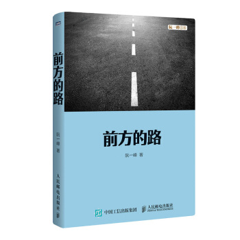

本书已经出版了，欢迎购买。

> - [京东](http://search.jd.com/Search?keyword=%E5%89%8D%E6%96%B9%E7%9A%84%E8%B7%AF%20%E9%98%AE%E4%B8%80%E5%B3%B0&enc=utf-8&wq=%E5%89%8D%E6%96%B9%E7%9A%84%E8%B7%AF%20%E9%98%AE%E4%B8%80%E5%B3%B0)
> - [淘宝](https://s.taobao.com/search?q=%E5%89%8D%E6%96%B9%E7%9A%84%E8%B7%AF+%E9%98%AE%E4%B8%80%E5%B3%B0)
> - [亚马逊](https://www.amazon.cn/dp/B07DXRW8V6)
> - [当当](http://product.dangdang.com/25300550.html)

2003年，我有了自己的博客，用来存放读书笔记，一直写到现在。

这里收录的是2014年以前的文章，其中的一部分曾经出版过，当时的书名是《如何变得有思想》。2014年以后的文章，收录在另一本文集[《未来世界的幸存者》](https://ruanyf.github.io/survivor/)。

这次重新编辑，替换了大部分文章，书名改成《前方的路》，出自德国作家黑塞的小说《德米安》，因为这些文字都是我寻找人生道路的记录。

> “每个人的生活都是一条通向自身的道路。每个人的真正职责只有一个：找到自我。然后在心中坚守一生，全心全意，永不停息。
>
> 所有其它的路都是不完整的，是人的逃避方式，是对社会角色的懦弱伪装，是随波逐流，是对内心的恐惧。”

